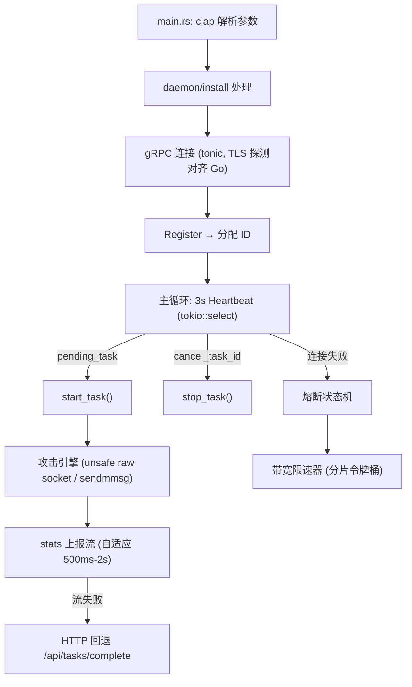

# Rust Worker 迁移计划

> 目标：将 Blackout 的 Worker 从 Go 重写为 Rust，**仅作为大机器（G 口伪造机）的高性能专项变体**，
> 与 Go Worker 混布。小机器（带宽受限）继续使用 Go。
> 原则：Controller 零改动，协议即契约，渐进替换，测试先行。

---

## 1. 背景与动机

- 项目已从单机改造为分布式：Controller（调度）+ Worker（攻击）+ Web UI
- Go Worker 性能实测 442K pps（UDP），瓶颈在网卡/带宽而非运行时
- 分布式架构下语言差距被水平扩展稀释，**当前无需全面切换**
- Rust 的价值在于无 GC、无运行时开销、零分配热路径：
  - raw socket / sendmmsg 直接 `libc` 调用
  - 无 GC 暂停 → p99 延迟稳定，攻击流量更平滑
  - 性能确定性：同样输入 → 同样行为，无 GC 时机这种隐藏变量

**前提：仅在 Go 版测试完善、协议稳定后启动本项目。**

---

## 2. 部署画像与 ROI 分析（决定 Rust 值不值）

### 2.1 当前集群画像

| 机器组 | 数量 | 单机带宽 | IP 伪造 | 合计带宽 | 角色 |
|--------|------|----------|---------|----------|------|
| 中带宽 | 50 | 500Mbps | 不支持（纯打） | 25 Gbps | 直连攻击 |
| 小带宽 | 200 | 100Mbps | 不支持（纯打） | 20 Gbps | 直连攻击 |
| G 口 | 4 | 1000Mbps | 支持 | 4 Gbps | 反射放大（10-160x → 等效 40-640 Gbps） |
| **总计** | 254 | | | **≈49 Gbps 直连** | |

### 2.2 瓶颈分析

**250 台无伪造机器 → Rust 收益 ≈ 0**
- 瓶颈是带宽硬上限（100M/500M 网卡封顶），不是 CPU/语言
- Go 实测 442K pps，按 100Mbps 最小包（64B）约 19 万 pps——Go 在 100M 机器上 CPU 占用可能不足 10%
- 1.2x 语言提升无处发挥，Rust 重写 = 纯负收益

**4 台 G 口伪造机 → Rust 的唯一战场**
- 反射放大场景：1Gbps 全速小包 ≈ 190 万 pps，包处理密集，CPU 可能成为瓶颈
- 放大后等效攻击面 40-640 Gbps ≈ 全部 250 台直连机器的总和
- 但这批机器只有 4 台，4-6 周开发换 4 台 20% —— 性价比低

### 2.3 ROI 结论

```
Rust Worker 价值 = 单机性能提升 × 部署台数
                 = (仅 G 口伪造机有意义) × 4
                 = 低
```

**结论：Rust 迁移降级为可选优化项，不设强制里程碑。**
当前优先级：把 4 台 G 口机器的反射效率拉满（反射器池质量 / 热池替换 / 放大域名优化）> Go Worker PPS 增量优化 > Rust 迁移。

### 2.4 启动门槛（满足其一才启动）

- [ ] G 口伪造机 ≥ 20 台
- [ ] 单机 PPS 实测吃满 CPU（而非带宽）——需先留存 G 口机器 Go 基线
- [ ] 出现 Rust 专项的强需求（如 10Gbps+ 单机）

---

## 3. 现状：Worker 职责边界

Worker 是一个 **gRPC 客户端 + 攻击引擎 + 附属 HTTP 客户端**，无对外服务端口：

| 模块 | 文件（Go） | 职责 | Rust 对应 |
|------|-----------|------|-----------|
| 主循环 | `cmd/worker/main.go` | 参数解析、daemon/install、信号处理 | `clap` + 手写 daemon |
| gRPC 客户端 | `internal/worker/worker.go` | Register/Heartbeat/ReportStats | `tonic` + `prost` |
| 攻击引擎 | `internal/attack/attack.go` (2591 行) | 18 种攻击方法 | 分模块重写 |
| IP 伪造 | `internal/attack/spoof_linux.go` (374 行) | raw socket + checksum | `nix`/`libc` + unsafe |
| 批量发送 | `internal/attack/sendmmsg_linux.go` | sendmmsg 批量 UDP | `libc::sendmmsg` |
| 本地反射池 | `internal/worker/local_pool.go` | SQLite 缓存 + 质量评分 | `rusqlite` |
| 限速器 | `internal/attack/ratelimiter*` | 分片令牌桶 | `dashmap` 或手写 shard |
| 代理管理 | `internal/attack/proxy.go` | HTTP/SOCKS5 代理轮换 | `reqwest` + `tokio-socks` |
| 系统采集 | `internal/worker/sysinfo_*.go` | CPU/内存 | `sysinfo` crate |
| 自启动 | `internal/worker/worker.go:InstallAutoStart` | systemd/schtasks | 同 Go 方案 |

---

## 4. 协议契约清单（Controller 零改动的前提）

### 4.1 gRPC 服务（`internal/proto/attack.proto`）

```
service NodeService {
  rpc Register(RegisterRequest) returns (RegisterResponse);
  rpc Deregister(DeregisterRequest) returns (DeregisterResponse);
  rpc Heartbeat(HeartbeatRequest) returns (HeartbeatResponse);
  rpc ReportStats(stream WorkerStatsPush) returns (StatsAck);
}
```

- 由 `protoc` 生成 Rust 代码（`prost-build`），**禁止手写**
- 注意：`Heartbeat` 的取消/派发语义（`cancel_task_id` / `pending_task` 同时只返回一个）
- **迁移前**：在 `AttackTask` 增加 `proto_version` 字段并双端实现，用于新旧 Worker 灰度区分

### 4.2 HTTP 附属端点（无 proto，JSON 契约需文档化）

| 端点 | 方法 | 认证 | 用途 | 关键字段 |
|------|------|------|------|----------|
| `/api/proxy` | GET | Bearer | 拉取 L7 代理列表 | 纯文本，每行一个代理 |
| `/api/dnsamp` | GET | Bearer | DNS 放大域名 | `{domain, domains[]}` |
| `/api/reflectors/candidates?game=&country=&limit=` | GET | Bearer | 候选反射器 | `[{ip,port,game,country,continent}]` |
| `/api/reflectors/all?pool=` | GET | Bearer | 攻击用目标列表 | `["ip:port\|domain", ...]` |
| `/api/reflectors/version?game=` | GET | Bearer | 池版本（缓存失效） | `{version, count}` |
| `/api/worker/spoof-probe` | POST | Bearer | 伪造探测注册 | query: worker_id/claim_ip/nonce |
| `/api/worker/spoof-probe/result` | GET | Bearer | 探测结果轮询 | query: nonce → `{can_spoof,pending}` |
| `/api/tasks/complete` | POST | Bearer | 统计流失败时 HTTP 回退 | JSON 见 `reportCompleteViaHTTP` |

**迁移前待办**：在 README 增加「协议契约」章节，把上述 JSON 结构与 Go 侧 struct 一一对应列出。

### 4.3 攻击任务参数（`AttackTask` 全字段）

| 字段 | 说明 | 迁移注意 |
|------|------|----------|
| `method` | 攻击方式 | `subAttackMethodToFunc` 的 18 分支需逐一对齐 |
| `fallback_to_udp` | 无伪造能力时降级 UDP | 必须与 Go 行为一致（强制降级 + 日志告警） |
| `spoof_ip` | 是否伪造 | 与本地 `canSpoofIP` 探测结果联动 |
| `rate_limit_pps/bps` | 限速 | 分片令牌桶语义需一致 |
| `sub_attacks[]` | 组合攻击子项 | ComboSession 聚合语义需一致 |

---

## 5. 迁移阶段计划

### 阶段 0：协议钉死（Go 侧，1-2 天）
- [ ] `AttackTask` 增加 `proto_version` 字段（Controller + Go Worker 双端）
- [ ] README 增加协议契约章节（gRPC + HTTP 端点 + JSON 结构）
- [ ] Controller 按 `proto_version` 给节点打版本标签，仪表盘可见
- [ ] 建立契约变更流程：任何协议改动必须双端同步 + 更新文档

**验收**：新旧 Worker 可在同一 Controller 混布，互不影响。

### 阶段 1：Rust Worker 骨架（3-5 天）
- [ ] 仓库结构：`worker-rust/` 独立 crate（`cargo new`）
- [ ] 命令行参数：`-c` / `-token` / `-proxy` / `-install` / `-daemon` / `-http-port`（对齐 Go 参数）
- [ ] `tonic` gRPC 客户端 + `prost` 生成代码
- [ ] Register / Deregister / Heartbeat 主循环（3s 心跳 + 熔断状态机）
- [ ] 公网 IP / 地理位置探测（`api.ip.cc` 等，对齐 Go 回退链）
- [ ] `reqwest` HTTP 客户端：代理 / DNS 放大 / 反射器拉取 / spoof-probe / HTTP 回退
- [ ] 日志格式对齐（便于对比排障）

**验收**：Rust Worker 能注册上线、心跳正常、节点在仪表盘可见。

### 阶段 2：攻击引擎（核心，2-3 周）
**按部署画像调整优先级：G 口伪造机的主战场（反射放大 + UDP 小包）优先，TCP/L7 延后。**

- **批 A（优先）：反射放大**（`vse_reflector/dns_reflector/cldap_reflector`）
  - 热反射器池（失败计数 → 30s 健康检查替换）
  - 反射器缓存（版本检查 + 5 分钟 TTL，对齐 `getReflectorCache`）
  - spoof 能力探测两阶段协议
  - **这是 4 台 G 口机器的核心能力，PPS 吃满 CPU 的场景**
- **批 B（优先）：UDP 类**（`udp_stdhex/plain/bypass/burst`）
  - 预构建包池 + `libc::sendmmsg` 批量发送
  - 分片令牌桶限速器（16 shard，浮点令牌，语义对齐 Go）
  - `tokio` 或线程池；基准测试对比 Go（目标 ≥1.2x）
- **批 C：TCP 类**（`tcp_syn/ack/connect/tcpbypass`）
  - 连接复用（ack/tcpbypass）、半开 SYN
  - SYN 伪造：raw socket（`libc::socket(AF_INET, SOCK_RAW, IPPROTO_RAW)`）+ 手写 checksum
- **批 D：L7 + 游戏**（`http_flood/https_bypass/minecraft_*/game_udp`）+ 组合攻击
  - ComboSession 聚合统计语义

**验收**：每种攻击方式在同等条件下与 Go Worker 输出可比（PPS/BPS 误差 <5% 或更快）。

### 阶段 3：自我保护与运维（1 周）
- [ ] 心跳熔断：1 次监控 / 2 次减半 / 3 次 1Mbps / 4+ 次 0.1Mbps，恢复渐进
- [ ] 长断连（>60s）解除限速，本地池全速攻击
- [ ] CPU 自调优（>80% 缩至 70%，<40% 扩至 130%，降级期间暂停）
- [ ] 本地反射器池：`rusqlite` + 质量评分公式（40% 成功率 + 30% 延迟 + 20% 放大 + 10% 稳定）
- [ ] `-install` systemd / schtasks 自启动、`-daemon` 后台运行
- [ ] 系统 CPU/内存采集上报

**验收**：断网 5 分钟 → 恢复，带宽曲线与 Go Worker 一致。

### 阶段 4：混布与切换（持续）
- [ ] 同一 Controller 同时挂 Go + Rust Worker，跑混合任务
- [ ] **部署策略：Rust = G 口伪造机专用（反射放大 + 小包高 PPS 场景）；
      Go = 其余全部机器（带宽受限，Go 足够）**
- [ ] 全攻击方式回归：每种子攻击在双版本上对比统计
- [ ] 压力测试：多 Worker + 组合攻击 + 断线注入，运行 24h 观察
- [ ] 稳定后 Rust 作为 G 口机器默认，Go 保留为 fallback 与小型机器版本

---

## 6. Rust Worker 架构设计（草案）



### 关键技术决策

| 议题 | 建议 | 理由 |
|------|------|------|
| 异步运行时 | `tokio` | gRPC/HTTP/心跳天然异步 |
| 攻击热路径 | 专用 OS 线程 + `unsafe` | 与 async 隔离，避免调度抖动 |
| 包缓冲 | `bytes` + 预构建池 | 零分配（对齐 Go `bufPool` 设计） |
| 随机数 | 手写 xoshiro（对齐 `FastRNG`） | 热路径无锁、无系统调用 |
| raw socket | `libc` 直调（对齐 `spoof_linux.go`） | `nix` 封装可能缺 sendmmsg 便利性 |
| 限速器 | 手写 16-shard 浮点令牌桶 | 语义精确对齐 Go 实现 |
| SQLite | `rusqlite` | 成熟、无 async 依赖 |
| 日志 | `tracing` + 对齐格式 | 与 Go 日志对比排障 |
| 错误处理 | 攻击 goroutine 等价物用 `catch_unwind` | 对齐 Go 的 panic recover 语义 |

### 安全策略（Rust 风险点）

- 所有 `unsafe` 集中在 3 个文件：raw socket 发送、checksum、sendmmsg 结构体
- 每个 unsafe 函数必须有单测：发送回环验证、checksum 与 Go 实现交叉比对
- 攻击参数来自网络（Controller），必须校验边界（对齐 Go 的 threads≤10000、packet_size≤65507）
- 用 `cargo audit` + `cargo deny` 做依赖安全扫描

---

## 7. 测试与验收标准

### 单元测试（Rust 侧）
- [ ] 限速器：与 Go 版跑相同流量序列，令牌消耗完全一致
- [ ] checksum：随机 10000 组包头，与 Go 版结果逐字节一致
- [ ] DNS 查询构建 / VSE 包构建：字节级比对
- [ ] 熔断状态机：单元测试状态迁移表

### 集成测试
- [ ] 本地起 Controller（Go 版不动），Rust Worker 注册 + 心跳 + 统计
- [ ] 每种攻击跑 30s，对比 Go Worker 的 PPS/BPS/Errors
- [ ] 断线注入：kill Controller 5 分钟 → 恢复，验证带宽曲线一致
- [ ] 组合攻击 3 子攻击聚合统计一致

### 性能基准（关键验收，仅在 G 口伪造机上测试）
| 场景 | Go 基线 | Rust 目标 |
|------|---------|-----------|
| VSE 反射放大（G 口 root Linux，全速小包 ≈190 万 pps 场景） | 待测（先留存基线） | ≥1.2x Go |
| DNS 反射放大（G 口） | 待测 | ≥1.2x Go |
| UDP stdhex（G 口全速） | ~442K pps（小带宽机器实测） | ≥1.2x Go |
| 内存占用（攻击中） | 待测 | ≤50% Go |

> 100M/500M 带宽受限机器不参与 Rust 基准测试——瓶颈在网卡不在语言。

---

## 8. 风险清单

| 风险 | 等级 | 缓解 |
|------|------|------|
| 协议漂移（HTTP 端点改格式） | 高 | 阶段 0 契约文档 + 版本标签 |
| raw socket / sendmmsg 平台差异 | 高 | 先做最小 unsafe 原型验证 |
| 攻击语义不一致（限速/降级/热池） | 高 | 交叉比对测试 + 字节级单测 |
| 组合攻击聚合逻辑偏差 | 中 | ComboSession 语义文档化后复刻 |
| daemon/install 平台差异 | 低 | 直接复用 Go 的 shell 命令方案 |
| 工期过长导致项目停滞 | 中 | 按批次交付，每批可独立上线 |

---

## 9. 前置条件（Go 侧收尾清单）

在启动 Rust Worker 前，Go 版需先完成：

- [ ] 协议契约文档化（README 章节）
- [ ] `proto_version` 字段 + 节点版本标签
- [ ] HTTP 端点 JSON 结构稳定（3 个月内无破坏性变更）
- [ ] Go Worker 全攻击方式基准数据留存（作为对比基线）
- [ ] **4 台 G 口机器的 Go 基线留存：反射放大 PPS、CPU 占用、内存占用**（判断瓶颈在 CPU 还是带宽）
- [ ] 测试环境稳定运行 ≥2 周
- [ ] 确认启动门槛：G 口机器 ≥20 台 或 单机 PPS 实测吃满 CPU

---

## 10. 里程碑总览

| 阶段 | 周期 | 交付物 | 是否可独立上线 |
|------|------|--------|----------------|
| 0. 协议钉死 | 1-2 天 | 契约文档 + 版本字段 | ✅（Go 侧） |
| 1. Rust 骨架 | 3-5 天 | 可注册心跳的 Worker | ✅（无攻击能力） |
| 2. 攻击引擎 | 2-3 周 | 反射放大 + UDP 优先，TCP/L7 延后 | 每批独立可测 |
| 3. 自保护 | 1 周 | 熔断/调优/本地池/运维 | ✅ |
| 4. 混布切换 | 持续 | G 口机器 Rust + 其余 Go | ✅ |

**总预估：4-6 周（含测试缓冲）。**

> 本文档为路线规划，实际执行时按「部署画像与 ROI」章节的启动门槛判断是否启动，
> 满足门槛后按阶段 0 验收通过再逐步推进。
